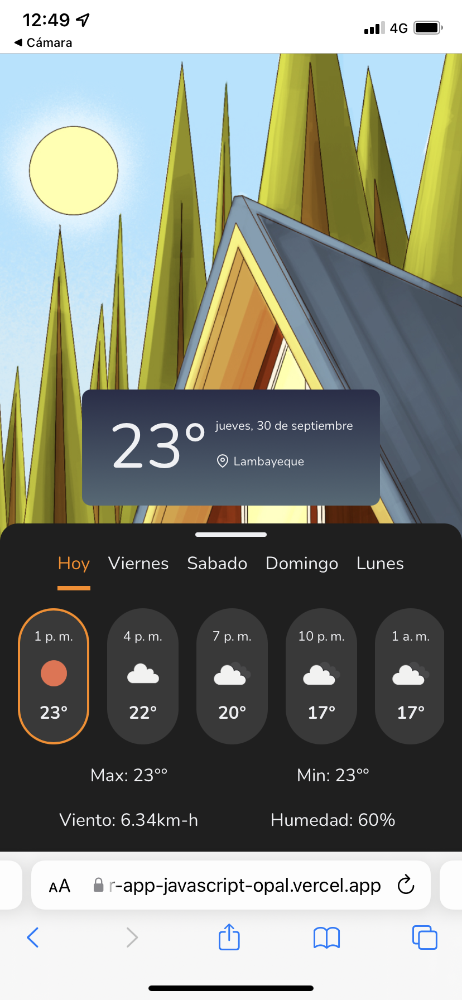
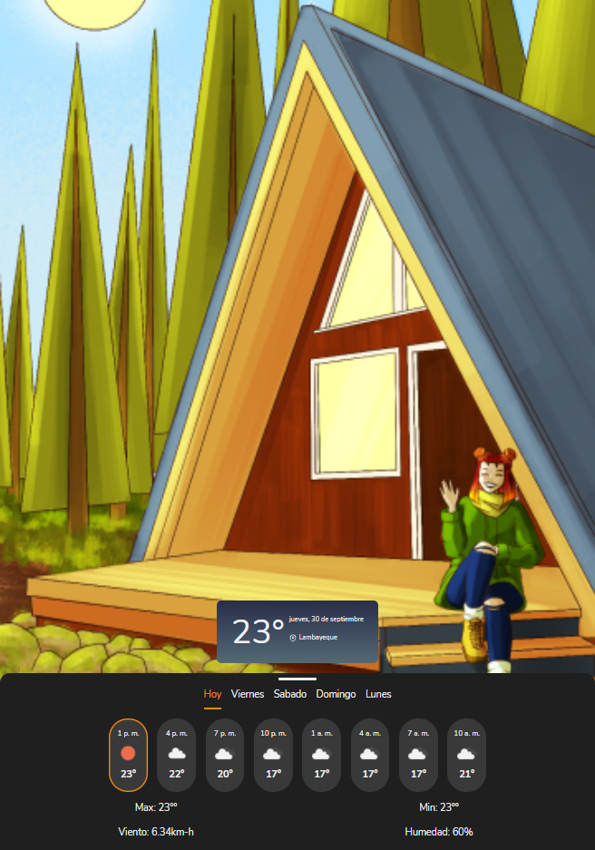

# Curso esencial de JavaScript y el DOM ⛅

Este proyecto es parte del **Curso esencial de JavaScript y el DOM** de 
[leonidasesteban.com](https://leonidasesteban.com/aprender/javascript), que en mi opinión, es uno de los mejores cursos de JavaScript que puede haber y el proyecto junto con el reto increible.

Fue muy importante para mi este curso y muy retador, muchas cosas que desconocia y ahora que las conozco me toca practicar y seguir estudiando.
Muy agradecido 🙏

### Demo :computer:

Has click en el enlace para ver el  **[resultado](https://weather-app-javascript-opal.vercel.app/)** 

  <table><tr>
 <td style="text-align:center">
  
 </td>
 <td style="text-align:center">
   
 </td>
 <td style="text-align:center">
   
 </td>
 </tr></table>

### Imagenes :camera:

